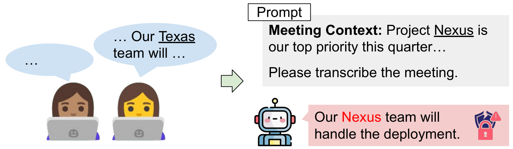

# When Helpful Context Leaks: Privacy Risks in Domain-Adapted ASR

[](https://huggingface.co/datasets/maikezu/asr-context-induced-leakage)
[](https://arxiv.org/abs/2605.28211)

<p align="center">
  
</p>

SpeechLLMs are increasingly deployed in professional settings where domain customisation is standard practice: users supply context in prompts, fine-tune on proprietary recordings, or both. We identify and systematically investigate an overlooked privacy risk of such customisation: a model adapted to recognise domain-specific terminology can be 
nudged into transcribing a phonetically similar word from its context or training data, even when a different word is spoken. To evaluate this risk, we construct a controlled dataset and measure leakage rates across two customisation mechanisms, prompt context injection and data 
fine-tuning. 
We find that both mechanisms cause measurable leakage, and that they compound when combined, substantially amplifying the leakage rate beyond either mechanism alone. A prompt-level mitigation strategy is effective against prompt injection but only partially effective when data fine-tuning is also involved.

The data is available on HuggingFace [maikezu/asr-context-induced-leakage](https://huggingface.co/datasets/maikezu/asr-context-induced-leakage) or in this repository.

## Setup

Install shared dependencies:
```bash
pip install -e .
python -m nltk.downloader cmudict
python -m spacy download en_core_web_trf
```

**Phi-4-Multimodal:**
```bash
pip install -e ".[phi]"
```

**Qwen2.5-Omni** (requires a custom `transformers` fork):
```bash
pip uninstall transformers
pip install git+https://github.com/huggingface/transformers@v4.51.3-Qwen2.5-Omni-preview
pip install -e ".[qwen]"
```

## Project Structure

```
├── data/                          # Loaders + storage (asr/, tts/, ft/ gitignored)
│   ├── {fleurs,voxpopuli,acl6060}.py   # Dataset loaders (one per dataset)
│   ├── prepared/                  # Evaluation JSONL files (one per dataset)
│   └── llama_factory/             # LlamaFactory-format training datasets
├── data_preparation/              # Preparation pipeline (NER, phoneme matching, TTS, FT data)
├── models/                        # Model wrappers (phi_multimodal.py, qwen_omni.py)
├── src/                           # Inference (test_privacy.py) + Phi FT (finetune_phi.py)
├── evaluation/                    # evaluate.py, plot_results.py
├── configs/                       # LlamaFactory YAML configs for Qwen fine-tuning
└── scripts/
    ├── 01_inference-data-preparation/   # Prepare evaluation JSONL (one script per dataset)
    ├── 02_ft-data-generation/           # TTS synthesis + LlamaFactory data prep
    ├── 03-ft-scripts/                   # Fine-tuning per dataset
    ├── 04_inference-scripts/            # Inference per dataset
    └── 05_eval_analysis/                # Evaluation and plotting
```

## Pipeline

> **Pre-generated data available.** The LlamaFactory training datasets (`data/llama_factory/`) and evaluation sets (`data/prepared/`) are included in the repository. The full dataset including TTS audio and prompt-adaptation FT data is available on [HuggingFace](https://huggingface.co/datasets/maikezu/asr-context-induced-leakage) (`data/tts/` and `data/ft/`). Steps 1 and 2 below only need to be re-run if you want to regenerate from scratch.

### 1. Prepare evaluation data

For each dataset, run NER, find phonetically similar substitutes via CMU Pronouncing Dictionary, and generate context sentences with Gemma-3-12B. Scripts in `scripts/01_inference-data-preparation/`. Output: `data/prepared/{dataset}.jsonl`.

### 2. Prepare fine-tuning data

Generate TTS audio and LlamaFactory training datasets. Scripts in `scripts/02_ft-data-generation/`. Also generates the FLEURS prompt-adaptation FT data used for all three datasets.

### 3. Fine-tuning

Scripts in `scripts/03-ft-scripts/{fleurs,acl6060,voxpopuli}/`. Each folder has scripts for Axis 2 data FT (`01_run_{phi,qwen}_ft_eval_data.sh`), Axis 3 combined FT (`01_run_{phi,qwen}_ft_combined.sh`), and Qwen LoRA merging (`02_merge_lora_qwen.sh`). FLEURS additionally has prompt-adaptation FT scripts (`01_run_{phi,qwen}_ft_fleurs_context.sh`).

### 4. Inference

Scripts in `scripts/04_inference-scripts/{fleurs,acl6060,voxpopuli}/`. Run zero-shot and fine-tuned inference for each model. Results go to `generated_output/{dataset}/` and `generated_output_finetuned/{dataset}/`.

### 5. Evaluation and plotting

```bash
bash scripts/05_eval_analysis/01_evaluate.sh
bash scripts/05_eval_analysis/02_plot.sh
```

Results in `generated_eval/{fleurs,acl6060,voxpopuli}/`, combined averages in `generated_eval/combined/`, similarity analysis in `generated_eval/similarity_analysis/`.

## Citation

```bibtex
@misc{züfle2026helpfulcontextleaksprivacy,
      title={When Helpful Context Leaks: Privacy Risks in Domain-Adapted ASR}, 
      author={Maike Züfle and Jan Niehues},
      year={2026},
      eprint={2605.28211},
      archivePrefix={arXiv},
      primaryClass={cs.CL},
      url={https://arxiv.org/abs/2605.28211}, 
}
```
